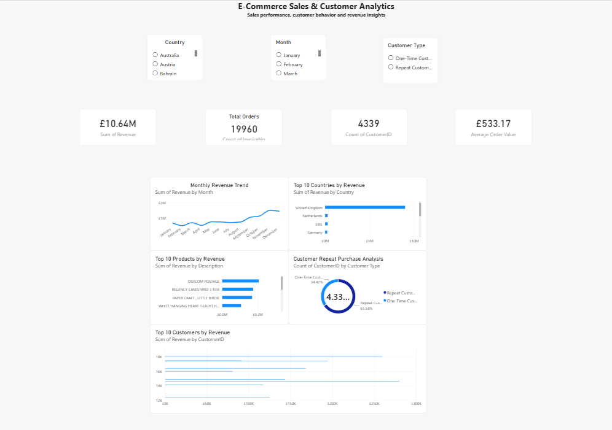

# E-Commerce Sales & Customer Analytics

## Project Overview

An end-to-end data analytics project analyzing e-commerce sales performance, customer behavior, product performance, and geographic revenue using Python, SQL, and Power BI.

## Business Objectives

- Analyze overall sales performance
- Identify monthly revenue trends
- Identify high-revenue countries
- Identify top-performing products
- Analyze customer purchasing frequency
- Compare repeat and one-time customers
- Identify high-value customers
- Build an interactive Power BI dashboard

## Dataset

**Online Retail Dataset — UCI Machine Learning Repository**

The dataset contains transaction-level information including invoice number, product description, quantity, invoice date, unit price, customer ID, and country.

Dataset source: https://archive.ics.uci.edu/dataset/352/online+retail

## Tools & Technologies

- Python
- Pandas
- Matplotlib
- SQL
- SQLite
- Power BI
- DAX
- Google Colab

## Data Cleaning

The original dataset contained **541,909 records**.

Data preparation included:

- Missing-value inspection
- Duplicate detection and removal
- Investigation of negative quantities representing returns/cancellations
- Removal of negative quantities from the main sales analysis
- Removal of non-positive unit prices
- Creation of a Revenue column

Revenue was calculated as:

`Revenue = Quantity × UnitPrice`

Customer-level analysis was performed using records with valid Customer IDs.

After cleaning, the dataset contained **524,878 records**.

## Key KPIs

| KPI | Result |
|---|---:|
| Total Revenue | £10,642,110.80 |
| Total Orders | 19,960 |
| Unique Customers | 4,338 |
| Unique Products | 3,922 |
| Average Order Value | £533.17 |
| Repeat Customers | 2,845 |
| Repeat Customer Rate | 65.58% |

## SQL Analysis

SQL was used to analyze:

- Total revenue
- Total orders
- Revenue by country
- Top products by revenue
- Top customers by revenue
- Orders per customer
- Repeat customers
- Repeat customer rate
- Average order value

The complete queries are available in `SQL_Queries.sql`.

## Power BI Dashboard

The dashboard includes:

- Total Revenue
- Total Orders
- Unique Customers
- Average Order Value
- Monthly Revenue Trend
- Top 10 Countries by Revenue
- Top 10 Products by Revenue
- Customer Repeat Purchase Analysis
- Top 10 Customers by Revenue
- Country, Month, and Customer Type filters

## Key Business Insights

- The cleaned dataset generated approximately **£10.64 million in revenue across 19,960 orders**.
- The **United Kingdom** generated the highest revenue among the countries analyzed.
- **2,845 customers** were identified as repeat customers.
- Repeat customers represented approximately **65.58%** of customers with identified Customer IDs.
- Product-level analysis highlights the products contributing the highest revenue.
- Customer-level analysis identifies high-value customers contributing significant revenue.

## Project Workflow

Raw Dataset → Data Cleaning → Python Analysis → SQL Analysis → Power BI Dashboard → Business Insights

## Skills Demonstrated

- Data Cleaning & Validation
- Exploratory Data Analysis
- SQL
- Python / Pandas
- Power BI
- DAX
- KPI Development
- Customer Analytics
- Revenue Analysis
- Data Visualization
- Business Insights

## Dashboard Preview

